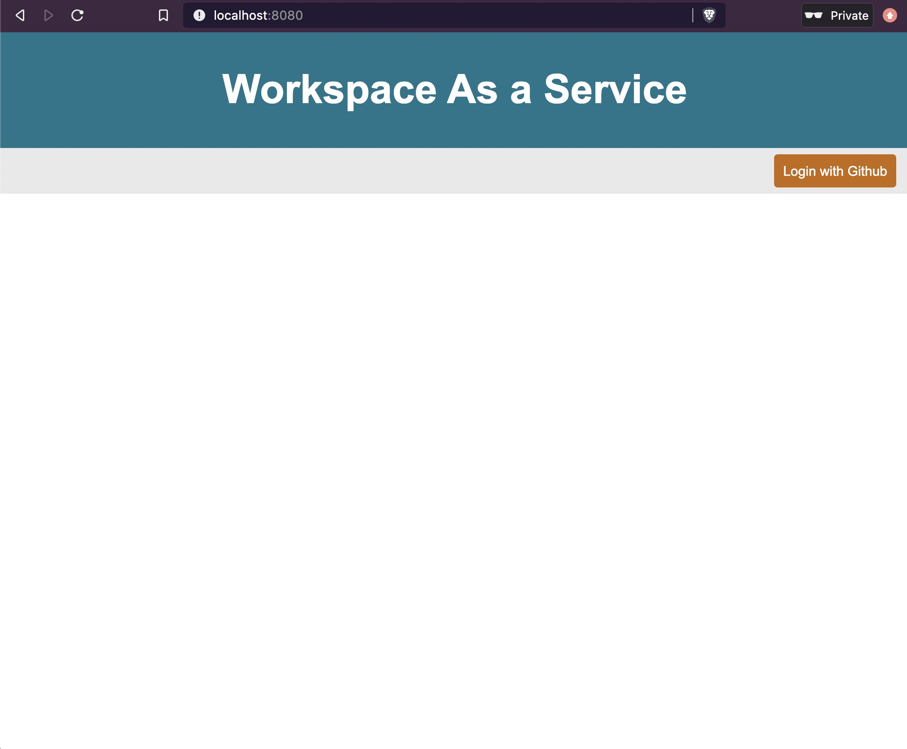
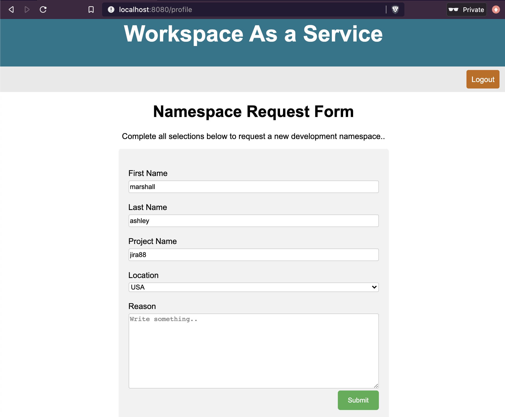
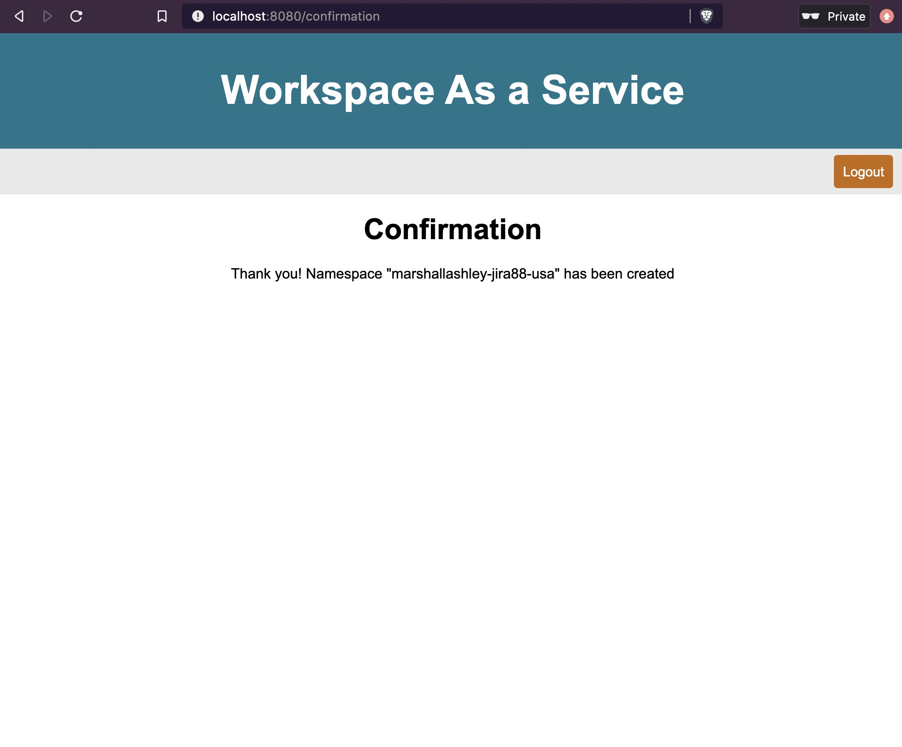
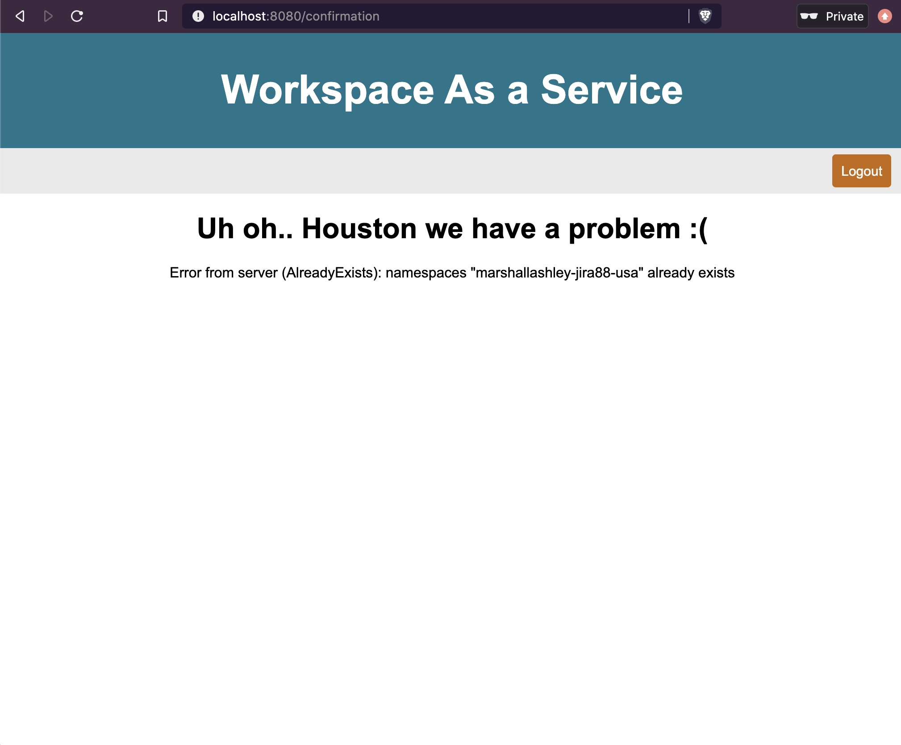

# K8s_Namespace_App


K8s_Namespace_App is a K8s namespace request/provisioning UI that has been written in go. 

*Note:*
- K8s_Namespace_App by default takes current Kubernetes `context`, please ensure your current-context points towards a suitable cluster.
- Currently only Github authentication is supported.
- CI/CD integration is scheduled for future relase.


**Dependencies**

 1. Access to a k8s cluster (local experiementation is best)
 2. Golang
 3. Setup Github Application for `ClientID` and `ClientSecret` within your [Github Developer Settings.](https://github.com/settings/developers)
 4. Pass the Github client id and secret as arguments or set the GITHUB_CLIENT_ID and GITHUB_CLIENT_SECRET
 ```
 export GITHUB_CLIENT_SECRET=<your client secret>
 export GITHUB_CLIENT_ID=<your client id>
 ```
 
 
**Launch Instructions**

 1. Clone repo and cd to k8s_local_dev directory
 ```git clone git@github.com:mblakeashley/noob-go-project.git && cd noob-go-project/k8s_namespace_app ```
 3.  Execute `go run main.go`

**Example**
(run the app)
```
~$ go run main.go
2020/10/28 15:09:55 Starting Server listening on localhost:8080
```
(after form has been submitted)
```
~$ kubectl get ns
NAME                        STATUS   AGE
default                     Active   6h30m
kube-node-lease             Active   6h30m
kube-public                 Active   6h30m
kube-system                 Active   6h30m
local-path-storage          Active   6h30m
marshallashley-jira88-usa   Active   48m
monitoring                  Active   6h29m
```

**UI Walk-thru**
(Login with Github ID)


(Submitting Form)


(Successful Form Confirmation)


(Form Confirmation Error)

